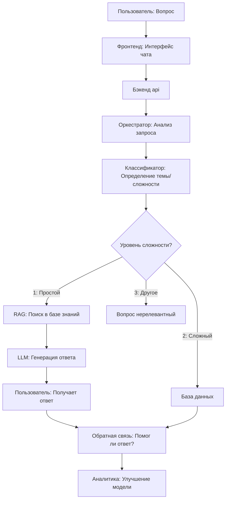

# sushki

# AI-ассистент для обработки обращений

это MVP-проект, созданный для хакатона. Он представляет собой интеллектуального ассистента, который:

- отвечает на простые вопросы на основе базы знаний (RAG)
- определяет тему обращения (классификация)
- эскалирует сложные кейсы человеку
- создаёт черновики тикетов
- работает через удобный интерфейс чата

## 🚀 Функциональность

- 🧠 RAG-ответы из базы знаний
- 🏷 Классификация обращений
- ⛑ Авто-эскалация сложных кейсов
- 🎫 Создание тикетов
- 💬 Фронтенд-чат
- 🐳 Docker-окружение
- 🧱 Чёткая структурированная архитектура

## 📁 Структура проекта
```
backend/          – API и логика бота  
frontend/         – пользовательский интерфейс  
data/             – база знаний, синтетика  
docker/           – Dockerfile'ы  
docs/             – документация  
docker-compose.yml – запуск всех сервисов  
```

## 📚 Документация

Документация лежит в папке /docs:

- installation.md — установка и запуск
- architecture.md — схема и описание архитектуры
- api.md — эндпоинты
- demo.md — сценарии для презентации

## 👥 Командная работа

Репозиторий поддерживает стандартный git-workflow:

- main — стабильная версия
- develop — интеграция
- feature/* — новые задачи

Перед слиянием — Pull Request + код-ревью.

## ✍ Схема



## 📞 Контакты

Автор репозитория: Варя
GitVerse: https://gitverse.ru/varv/sushki
